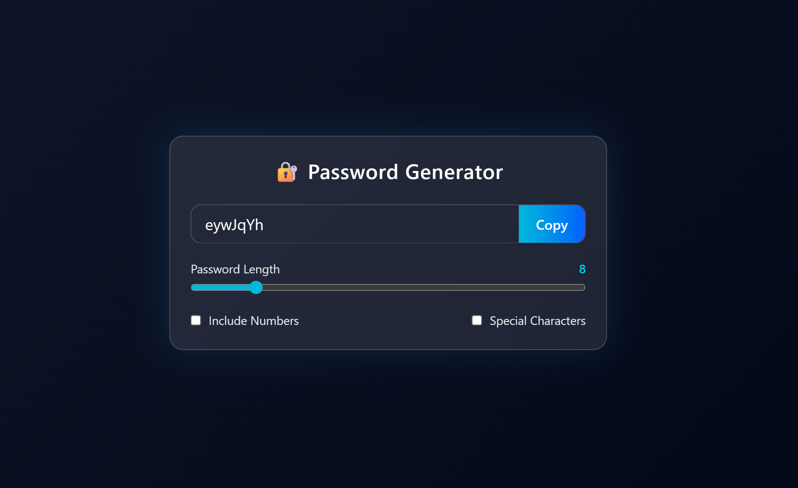

# 🔐 Password Generator

A modern, responsive **Password Generator** built with **React** and **Tailwind CSS**.  
Generate strong, customizable passwords instantly with a clean, professional UI.

---

## 🖼️ Preview



---

## ✨ Features

- 🔢 Adjustable password length (4–30 characters)
- 🔐 Option to include:
  - Numbers
  - Special characters
- 📋 One-click copy to clipboard
- 🎨 Modern glassmorphism UI
- 🌙 Dark theme with gradient background
- 📱 Fully responsive (desktop & mobile)

---

## 🚀 Tech Stack

- **React** (Hooks: `useState`, `useEffect`, `useCallback`, `useRef`)
- **Tailwind CSS**
- **JavaScript (ES6+)**
- **Vite / CRA compatible**

---

## 📂 Project Structure

```

password-generator/
├── public/
│   └── favicon.svg
├── src/
│   ├── App.jsx
│   ├── index.css
│   └── main.jsx
├── index.html
├── package.json
└── README.md

```

---

## ⚙️ Installation & Setup

### 1️⃣ Clone the repository

```bash
git clone https://github.com/your-username/password-generator.git
cd password-generator
```

### 2️⃣ Install dependencies

```bash
npm install
```

### 3️⃣ Run the development server

```bash
npm run dev
```

Open your browser at:

```
http://localhost:5173
```

---

## 🧠 How It Works

- Password is generated dynamically using random character selection
- React hooks handle:
  - State management
  - Auto-regeneration on option change

- Clipboard API is used for secure copying
- Tailwind utility classes power the entire UI

---

## 🎨 UI Highlights

- Glassmorphism card design
- Neon accent colors (cyan/blue)
- Smooth hover & focus states
- Emoji favicon for branding

---

## 🛡️ Security Notes

- Passwords are generated **locally**
- No data is stored or transmitted
- Clipboard access uses browser-native API

---

## 📄 License

This project is licensed under the **MIT License**.
